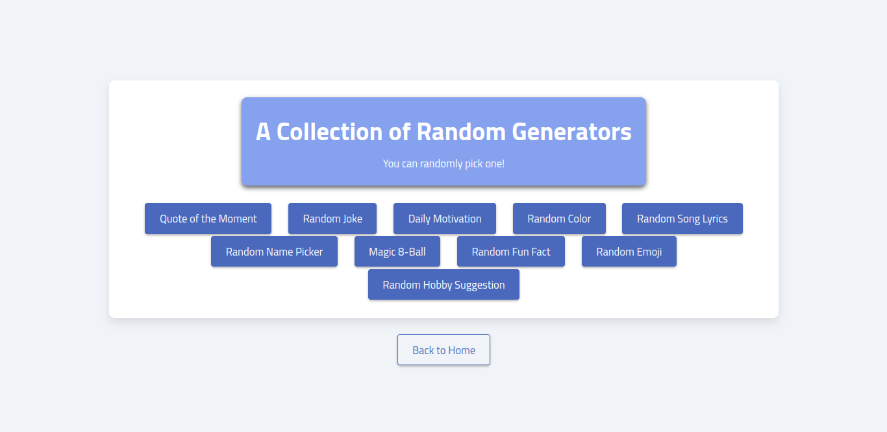
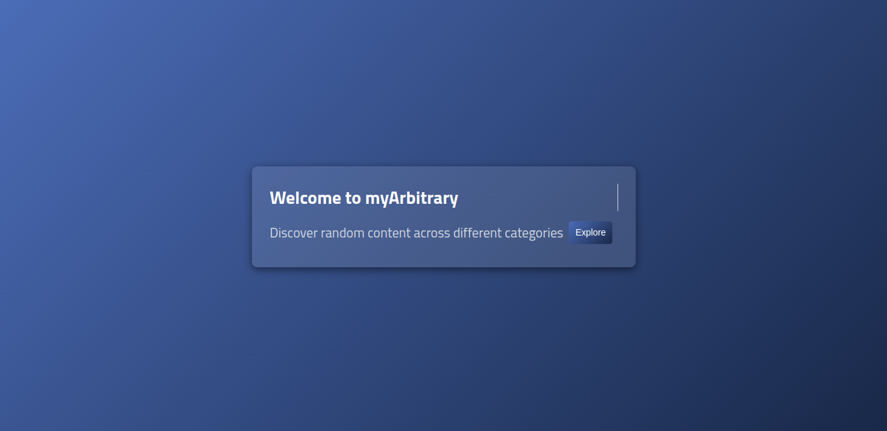

# myArbitrary

**myArbitrary** is a simple, fun web app that generates random content for users based on selected categories. <br/> This project focuses on utilizing `fetch` to retrieve data from various APIs and render it using HTML and CSS.

## Table of Contents
- [Features](#features)
- [Technologies Used](#technologies-used)
- [Installation](#installation)
- [Usage](#usage)
- [Contributing](#contributing)
- [Contact](#contact)

## Features
- Asynchronous data fetching using `fetch`, `async/await` and `then`
- Clean and responsive design rendered using HTML and CSS.

## Technologies Used
- **JavaScript**: For asynchronous data fetching and dynamic content updates.
- **HTML/CSS**: For rendering and styling the static pages.
- **APIs**: Data is fetched from various APIs depending on the category.

## Installation

To set up the app locally:

Clone the repository:
   ```bash
   git clone https://github.com/your-username/myArbitrary.git
   cd myArbitrary
  ```

## Usage
- Open the app in your browser.
- Explore various categories.
- Choose an item among the list to fetch random content from the API.
- Explore as more categories are added over time.





## Contributing
Contributions are welcome! If you'd like to contribute, here’s how:

1. Fork the repository.
2. Create a new branch for your feature or bug fix
3. Commit your changes
4. Push your branch

## Ideas for Contribution
- Add new random generators (e.g., quotes, trivia).
- Improve the UI design using CSS.
- Optimize the fetch and async logic.

## Contact
For feedback, questions, or collaboration opportunities, feel free to reach out:

- John Mburu
- mburujohn.dev@gmail.com
